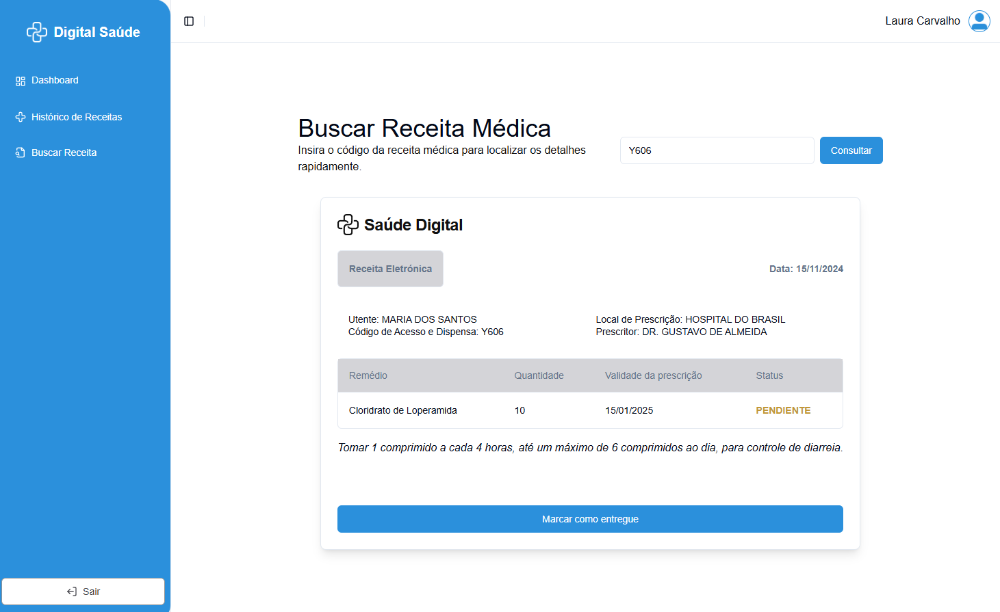

 
  <h1>+Digital Prescription</h1>

 
  
  
   
  
  
  
  
  
  
  
  
  
  

## Screenshots

  <h3>Doctor Dashboard</h3>
  

  <h3>Pharmacist Dashboard</h3>
  

  <h3>Prescription Details</h3>
  

