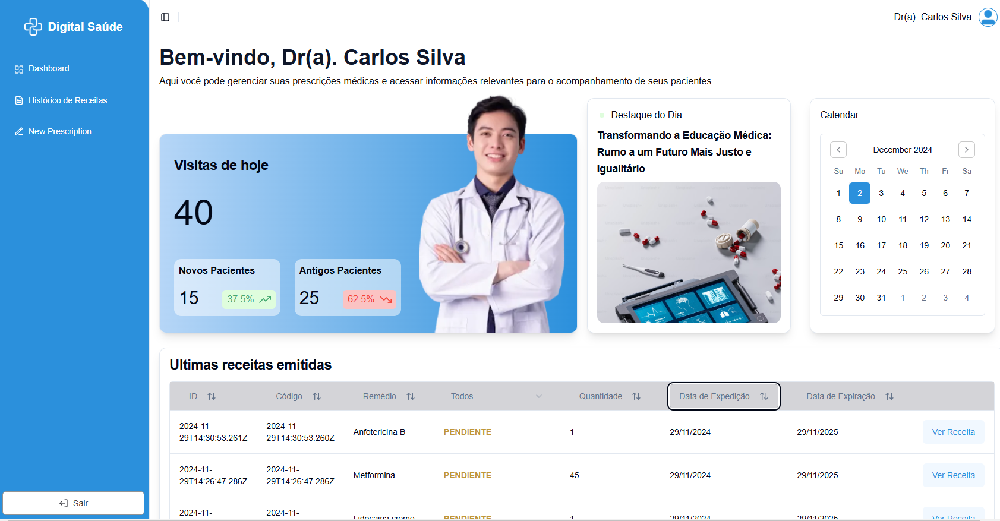

<div align="center"> 
  <h1>+Digital Prescription</h1>
</div>

<div align="center"> 
  
  
   
  
  
  
  
  
  
  
  
  
  
</div>

## About the Project  

+Digital Prescription is a web application designed to streamline prescription management for doctors, pharmacists, and patients. The project was initiated during the [ContCode Hackathon](https://www.contcode.io/) (November 22–24, 2024), but it was not fully completed during the event. After the hackathon, I decided to take the initiative and continue improving the project on my own. I implemented additional features and enhanced its functionality, as I didn't want to leave the project unfinished.  

This application enables dynamic dashboards based on user roles, such as doctors and pharmacists. Doctors can create prescriptions, while pharmacists can update prescription statuses and search for specific prescriptions. I focused on creating reusable components with **shadcn/ui** for flexibility and customization, ensuring type safety with **TypeScript** and organizing routes with **Next.js**.  

---

## Key Features  

- **Dynamic Dashboards**  
  - **Doctors:** Create and view prescriptions. Doctors can also search prescriptions by prescribed medication to easily find specific treatments. 
  - **Pharmacists:** View prescriptions, update statuses (Pending → Used), and search for specific prescriptions by code.  
  - **Patients:** Access prescription details.  

-  **Filter and Customize Prescription List:** The list of prescriptions can be filtered and customized based on various criteria.

- **Reusable Components:** Built using **shadcn/ui** for flexibility in styling and customization.  

- **TypeScript Integration:** Ensures type safety, reducing errors and improving data handling.  

- **Next.js Structure:** Simplifies routing and project organization.  

- **Responsive Design:** Optimized for web browsers.  

---

## Screenshots

<div align="center">
  <h3>Doctor Dashboard</h3>
  

  <h3>Pharmacist Dashboard</h3>
  

  <h3>Prescription Details</h3>
  
</div>

## How to Run the Project

To see how the project works, follow these steps:

1. Clone the repository:
   ```bash
   git clone https://github.com/EvelinAlvarado/digital-prescription.git
   ```
2. Navigate to the project directory:
    
    ```bash
    cd digital-prescription
     ```
3. Install the necessary dependencies:

    ```bash
    npm install
     ```
4. Run the development server:

    ```bash
    npm run dev
     ```
5. To view and create prescriptions, start the JSON server:

    ```bash
    npx json-server src/services/db.json --port 4000
     ```
This will allow you to view the prescriptions and create new ones directly from the app.

## Additional Information

- Find me on [GitHub](https://github.com/EvelinAlvarado) and [LinkedIn](https://www.linkedin.com/in/evelinalvarado/).

Links to the repositories created during the hackathon:  

- **Frontend:** [open-health-frontend](https://github.com/EvelinAlvarado/open-health-frontend)  
- **Backend:** [digital-saude-api](https://github.com/rgvieiraoficial/digital-saude-api)  

